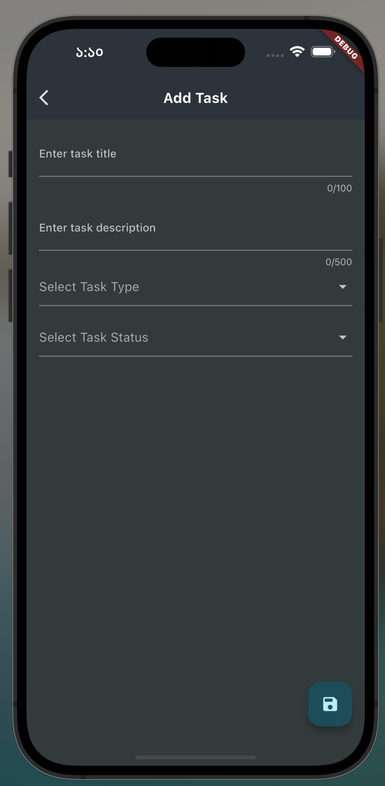

# Daily Routine 

In our day-to-day tasks we have some tasks that are very important and also considering the deadline also urgent. So we need to pick those tasks whenever we get the chance. Again some tasks are not urgent but they are important for us. So what can we do we can categorize our tasks into 4 separate categories. 

- Urgent & Important

- Urgent but Not Important

- Not Urgent but Important

- Not Urgent & Not Important

So putting our day to day task into these category helps us to prioritize which task should pick first and which kinds of task we can do in our leisure time as well.

So I was thinking why not create a separate app for this? So here is the Daily Routine. A simple task management app for you. You can modify the code to fulfill your needs. I tried to make it as simple as possible. For architecture pattern, I used clean code architecture here. 

Yes, lots of things can be improved. This is the first step to make it better. Will update it regularly from now on.

## Features

- All tasks where you can see all available tasks.
- Add new task or edit existing task.
- Filter task by task type which mentioned above.
- Swipe task to remove.

## Tools and Architecture

- [RiverPod](https://pub.dev/packages/riverpod) for the state management
- [sqflite](https://pub.dev/packages/sqflite) for Sqlite Database
- [uuid](https://pub.dev/packages/uuid) for generating unique task id
- [Scrollable positined list](https://pub.dev/packages/scrollable_positioned_list) 

For the architecture used clean code architecture approach to architect the structure.

